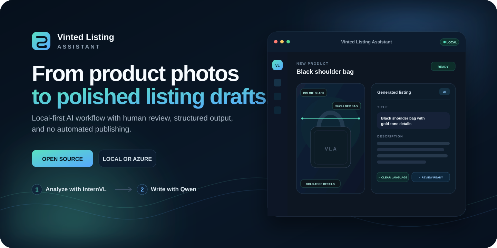
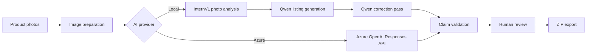

<div align="center">



<br>

[](https://krzyswo.github.io/Vinted-Listing-Assistant/)
[](https://github.com/krzyswo/Vinted-Listing-Assistant/actions/workflows/pages.yml)
[](LICENSE)
[](https://www.python.org/)

**A local-first AI workspace for product photo analysis, structured product data, and polished listing drafts.**

[Live website](https://krzyswo.github.io/Vinted-Listing-Assistant/) · [Quick start](#quick-start) · [How it works](#how-it-works) · [AI providers](#ai-providers) · [Security](SECURITY.md)

[Polska wersja README](README.pl.md)

</div>

---

## Why this project exists

Preparing a good resale listing is repetitive: inspect photos, identify product details, write a title, describe the condition, check the wording, resize images, and keep everything organized.

**Vinted Listing Assistant brings that work into one local application.** It helps you prepare a listing draft while keeping final verification and publishing under human control.

> [!IMPORTANT]
> This project does **not** log in to Vinted, publish listings, send messages, scrape the platform, refresh listings, or automate browser actions. It prepares content for manual review and publication.

<table>
<tr>
<td width="33%" valign="top">

### Photo intelligence

Analyze product type, dominant color, pattern, visible features, labels, and possible defects.

</td>
<td width="33%" valign="top">

### Better writing

Generate a clear title and description, then apply a second language-correction pass.

</td>
<td width="33%" valign="top">

### Human-reviewed output

Keep uncertain claims visible and verify brand, material, condition, defects, and authenticity yourself.

</td>
</tr>
</table>

## Highlights

- Import up to **10 product photos**.
- Preserve originals and create optimized publishing copies.
- Correct EXIF orientation, resize images, remove metadata, and apply restrained enhancement.
- Store products, AI generations, warnings, and status history in local SQLite storage.
- Use **separate local models** for image understanding and final writing.
- Use **Azure OpenAI Responses API** as an alternative provider.
- Generate structured JSON, a title, description, category suggestion, warnings, and optional price guidance.
- Reduce typos, incorrect inflection, awkward diminutives, and exaggerated sales language.
- Export the reviewed text and processed photos as a ZIP package.

## How it works



### Recommended local pipeline

<table>
<tr>
<th>Stage</th>
<th>Recommended model</th>
<th>Responsibility</th>
</tr>
<tr>
<td><strong>Photo analysis</strong></td>
<td><code>InternVL3.5-14B Q6_K_M</code></td>
<td>Product type, color, pattern, style, visible features, labels, possible defects, uncertainty</td>
</tr>
<tr>
<td><strong>Listing generation</strong></td>
<td><code>Qwen3.5-9B</code></td>
<td>Title, description, category, structured output, language correction</td>
</tr>
</table>

With LM Studio configured for JIT loading and one resident model, the models can load sequentially instead of occupying VRAM at the same time.

## AI providers

<table>
<tr>
<th width="50%">Local / OpenAI-compatible</th>
<th width="50%">Azure OpenAI</th>
</tr>
<tr>
<td valign="top">

- Works with LM Studio and compatible servers
- Separate vision and writing models
- Can stay on your machine or local network
- Exact model IDs come from <code>/v1/models</code>
- Recommended for maximum local control

</td>
<td valign="top">

- Uses the Azure OpenAI Responses API
- One deployment can handle analysis and generation
- Structured outputs supported by the integration
- Useful when managed availability matters
- Azure and local settings are stored separately

</td>
</tr>
</table>

## Quick start

### Windows

1. Install **Python 3.12** and enable `Add Python to PATH`.
2. Clone or download this repository.
3. Run:

```text
Instaluj-Vinted-Assistant.cmd
```

4. Start the application:

```text
Uruchom-Vinted-Assistant.cmd
```

The launcher selects the first available local port starting at `8092` and opens the application in your browser.

### Manual installation

```bash
git clone https://github.com/krzyswo/Vinted-Listing-Assistant.git
cd Vinted-Listing-Assistant
python -m venv .venv
```

Windows PowerShell:

```powershell
.\.venv\Scripts\Activate.ps1
python -m pip install --upgrade pip
python -m pip install -r requirements.txt
python -m uvicorn app.main:app --host 127.0.0.1 --port 8092
```

Linux or macOS:

```bash
source .venv/bin/activate
python -m pip install --upgrade pip
python -m pip install -r requirements.txt
python -m uvicorn app.main:app --host 127.0.0.1 --port 8092
```

## Configuration

### Local model server

In **Ustawienia AI**, configure:

```text
Provider: LM Studio / OpenAI-compatible
API address: http://127.0.0.1:1234/v1
Photo-analysis model: your InternVL model ID
Listing-generation model: your Qwen model ID
```

The model identifiers must exactly match those returned by the server's `/v1/models` endpoint.

Recommended LM Studio settings:

```text
JIT Model Loading: ON
Maximum loaded models: 1
Auto-Evict: ON
Parallel Predictions: 1
```

### Azure OpenAI

In **Ustawienia AI**, select Azure OpenAI and provide:

```text
Endpoint: https://your-resource.cognitiveservices.azure.com/
Deployment: your deployment name
API version: 2025-04-01-preview
```

The application currently uses the Azure OpenAI Responses API. Never commit real API keys to source files, `.env`, screenshots, logs, issues, or pull requests.

## Guardrails

The assistant attempts to avoid presenting uncertain image-derived information as confirmed fact.

| Information | Default handling |
|---|---|
| Visible color and product type | Can be suggested automatically |
| Logo or printed brand name | Treated as a suggestion requiring verification |
| Natural leather or other material | Not confirmed without user input or reliable label evidence |
| “Like new” or “no signs of use” | Avoided when condition has not been provided |
| Authenticity | Never confirmed by image analysis |
| Hidden defects | Cannot be verified from photos |

> [!WARNING]
> AI output can be incomplete or wrong. Review the title, description, category, brand, material, size, condition, defects, measurements, authenticity, and price before publication.

## Data and privacy

Runtime data is stored locally:

```text
data/app.db
data/products/
data/exports/
logs/
```

These paths are excluded from Git.

- A local model server receives data at the endpoint you configure.
- Azure mode sends the selected image and product context to your Azure resource.
- API keys are currently stored in the local SQLite database in plain text.
- The application has no user authentication and should not be exposed directly to the public internet.

## Project structure

```text
app/
├── main.py
├── database.py
├── config.py
├── services/
├── static/
└── templates/
data/
logs/
tests/
docs/
└── GitHub Pages landing page
```

## Tests

Windows:

```text
Testuj-Vinted-Assistant.cmd
```

Manual:

```bash
python -m pytest -q
```

## Current limitations

- The application interface is currently Polish-only.
- Photo analysis currently uses the first processed image.
- API keys are stored locally without encryption.
- AI output always requires human review.
- Model availability and Azure API compatibility may change.
- The project prepares listing content but does not publish it.

## Contributing

Contributions are welcome. Start with [CONTRIBUTING.md](CONTRIBUTING.md).

For security-sensitive issues, follow [SECURITY.md](SECURITY.md) instead of opening a public issue.

## License

Licensed under the [MIT License](LICENSE).

## Trademark notice

This independent project is not affiliated with, endorsed by, or sponsored by Vinted, Microsoft, OpenAI, Qwen, OpenGVLab, or LM Studio. Product and company names are trademarks of their respective owners.

---

<div align="center">

### Build a better listing workflow

[](https://krzyswo.github.io/Vinted-Listing-Assistant/)
[](https://github.com/krzyswo/Vinted-Listing-Assistant)

</div>
